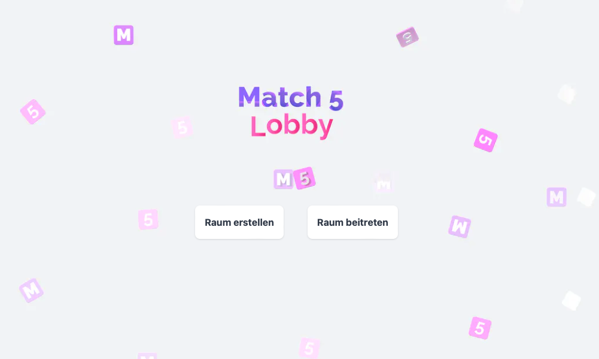
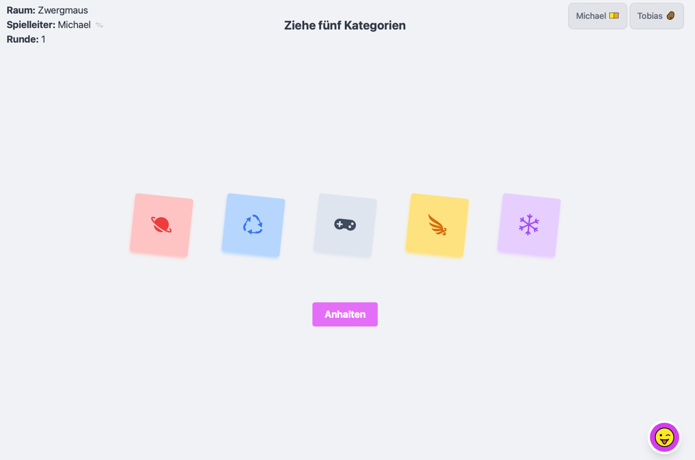
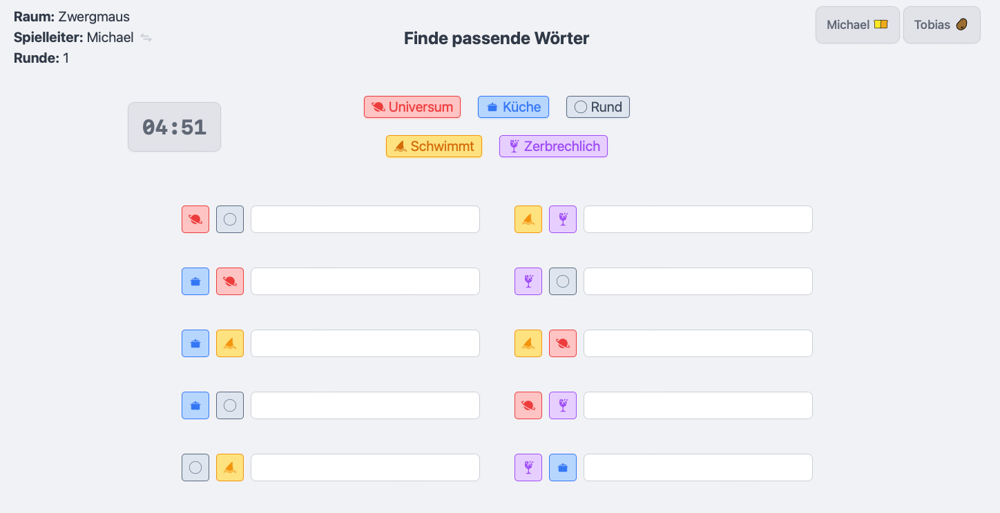

<p align="center">

</p>
<p float="left" align="middle">


</p>

# Match5 👾🎨
Digital version of the party game [Match5](https://boardgamegeek.com/boardgame/306169/match-5). Powered by NextJS, TailwindCSS and Pusher.

## Installation Instructions

### Clone this repository

```bash
git clone https://github.com/michaelheckmann/match5.git
```

### Install dependencies

```bash
cd match5
npm install
```

### Setup the environment

```bash
touch .env
```

### Run the dev server

```bash
npm run dev
```
